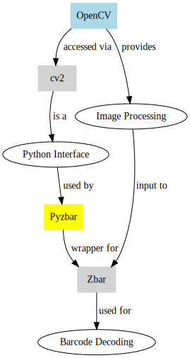

1. **What is OpenCV and How Does It Work?**
   - **OpenCV (Open Source Computer Vision Library)**: OpenCV is a comprehensive library primarily aimed at real-time computer vision. It's widely used for various applications like facial recognition, object detection, motion tracking, and more.
   - **Functionality**: OpenCV provides a vast range of tools and algorithms for image and video processing. It can process static images as well as video streams, detect and recognize faces, identify objects, classify human actions in videos, track camera movements, track moving objects, and extract 3D models of objects.
   - **Programming Languages**: Originally developed in C++, OpenCV now provides bindings for Python, Java, and several other languages, making it accessible for a wide range of applications.
   - **How It Works**: OpenCV functions by processing images and videos to detect objects and patterns using algorithms. For example, in facial recognition, it analyzes the various features of a face and compares them to known faces. In motion detection, it compares consecutive frames of video to identify movement.

2. **How Does OpenCV Relate to cv2?**
   - **cv2**: `cv2` is the Python interface for OpenCV. It's the module that Python uses to interface with OpenCV functions. When you use OpenCV in a Python environment, you typically import the library as `import cv2`.
   - **Interface**: Through `cv2`, Python can access all the functionalities of OpenCV. This includes image and video processing, feature detection, and the application of various computer vision algorithms.

3. **How Does OpenCV Integrate with Zbar?**
   - **Integration**: OpenCV can be used in conjunction with Zbar, a barcode and QR code reading library, for barcode detection and decoding. Typically, OpenCV is used to capture and preprocess images (like adjusting size, contrast, and filtering), and then these processed images are fed into Zbar for barcode detection.
   - **Workflow**: The workflow often involves OpenCV capturing an image from a camera feed, processing it (e.g., grayscale conversion, thresholding), and then passing it to Zbar for detecting and decoding the barcode data.

4. **How Does Pyzbar Relate to Zbar?**
   - **Pyzbar**: Pyzbar is a Python wrapper for the Zbar library. It provides a simple way to use Zbar functionalities in Python applications.
   - **Functionality**: Pyzbar allows Python applications to easily decode barcodes and QR codes from images or video streams. It simplifies the process of integrating barcode scanning features, particularly in applications that already use Python for other tasks.
   - **Usage**: In a typical use case, Pyzbar can be used in conjunction with OpenCV where OpenCV captures and preprocesses the image, and Pyzbar takes care of extracting barcode information from the processed image.

In summary, OpenCV and Pyzbar (as a wrapper for Zbar) often work together in Python applications to provide a complete solution for image processing and barcode/QR code scanning. OpenCV handles the image acquisition and preprocessing, while Pyzbar handles the decoding of barcode data from these images.