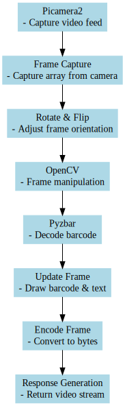

### 2. Overview of Technologies Used

#### **Flask Web Framework**
Flask is a lightweight and flexible web framework for Python, which has been used extensively in this project to create a responsive web interface. In your paper, you should discuss how Flask enables the creation of web routes, such as `@views.route('/', methods=['GET', 'POST'])`, and the handling of HTTP requests to facilitate user interactions with the inventory management system. Elaborate on Flask's simplicity and efficiency, particularly in building scalable web applications, and how it aids in rendering templates, managing user sessions, and interacting with other components of the project.

#### **Flask-Login**
Flask-Login plays a critical role in handling user authentication and session management in your application. Your discussion should focus on how Flask-Login manages user sessions to ensure secure access to the application. Highlight its features like session management, "remember me" functionality, and user loader callbacks, with specific examples from your code, such as `@login_required` decorators, to illustrate how access control is implemented for different routes.

#### **SQLAlchemy**
SQLAlchemy is an Object-Relational Mapping (ORM) library used in this project for database interactions. In your paper, explain how SQLAlchemy abstracts and simplifies database operations, allowing you to interact with the database using Python objects instead of writing raw SQL queries. Discuss its role in defining database models (`Note`, `FilamentInventory`), handling database sessions, and performing CRUD (Create, Read, Update, Delete) operations, which are essential for maintaining the filament inventory.

#### **NFC Technology**
Near Field Communication (NFC) technology is integral to your project for user identification. Describe how NFC technology is utilized to simplify the user authentication process. Focus on the implementation of the `get_nfc_uid_from_reader` function and how it interfaces with the NFC reader hardware to retrieve user-specific NFC IDs. This section should explain the significance of NFC in enhancing user experience by providing a quick and secure method for user identification.

#### **OpenCV and Pyzbar**
OpenCV (Open Source Computer Vision Library) and Pyzbar are pivotal in implementing barcode scanning and image processing in your project. Discuss how OpenCV is used for capturing and manipulating images from the camera, and Pyzbar's role in decoding barcodes from these images. This section should provide insight into how these technologies work together to facilitate real-time barcode scanning, which is crucial for logging filament usage based on scanned product SKUs.

#### **Picamera2**
Picamera2 is specific to Raspberry Pi and is used for camera integration in your project. Explain how Picamera2 provides a Python interface to the Raspberry Pi Camera Module, enabling the capture and processing of video feeds. Discuss its configuration, initialization (`picam2 = Picamera2()`), and how it is integrated into the Flask application to support real-time video capture and barcode scanning. Emphasize the importance of Picamera2 in enabling hardware interaction, which is a key aspect of your project's functionality. 

Each paragraph should provide a clear understanding of how these technologies contribute individually and collectively to the functionality of your inventory management system. Make sure to link these explanations back to the specific elements of your project to demonstrate their practical application.

