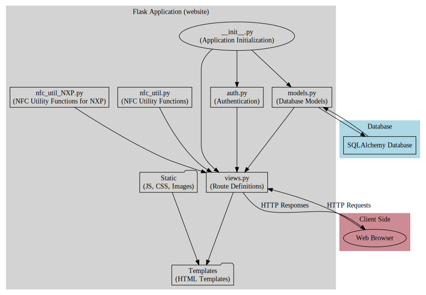

To understand how Flask applications work and how different parts are implemented in your website app, let's first look at the structure of a typical Flask application and then delve into the specifics of your project.

### Understanding Flask Applications

#### 1. **Basic Structure**
   - **Application Directory (`website/`)**: This is the main directory containing all the components of your Flask application.
   - **Initialization File (`__init__.py`)**: This file turns the directory into a Python package. In Flask apps, it's typically where the application instance is created, along with configurations and initialization of extensions like databases.

#### 2. **Key Components**
   - **Routes and Views (`views.py`)**: This file contains route definitions. Each route is linked to a view function, which returns a response (HTML page, JSON, etc.) for the requested URL.
   - **Models (`models.py`)**: This file defines the database schema. Models represent tables in your database.
   - **Authentication (`auth.py`)**: It likely handles user authentication, including user registration, login, and logout functionalities.
   - **Templates**: These are HTML files with placeholders for dynamic content. Flask uses Jinja2 templating engine.
       - `base.html`: A base template inherited by other templates.
       - `sign_up.html`, `login.html`, `home.html`, `user.html`, `inventory.html`: These are specific templates for different parts of your application.
   - **Static Files (`static/`)**: This directory stores static files like JavaScript (`index.js`), CSS, and images.
   - **Utility Scripts**: Like `nfc_util.py` and `nfc_util_NXP.py`, which probably contain helper functions or classes related to NFC functionality.

#### 3. **Running the Application**
   - The Flask app is typically started by running a Python script that imports and invokes the app instance.

### Specifics of Your Website App

#### 1. **Initialization and Configuration**
   - Your app is likely initialized in the `__init__.py` file, where Flask instance (`app = Flask(__name__)`) is created.
   - Configurations (like database connections, secret keys, etc.) are also set in this file.

#### 2. **Defining Routes and Views**
   - In `views.py`, you've defined various routes (`@app.route`) with their corresponding view functions. Each function handles a specific endpoint of your web application.

#### 3. **User Authentication and Session Management**
   - Handled in `auth.py`, including routes for user login, registration, and logout.
   - Utilizes `Flask-Login` for managing user sessions.

#### 4. **Database Models**
   - `models.py` defines the structure of your database tables (`Note`, `FilamentInventory`, etc.).

#### 5. **Template Rendering**
   - Each route in `views.py` renders a template with context. For example, `render_template("home.html", user=current_user)` in the home route.

#### 6. **NFC Integration**
   - `nfc_util_NXP.py` and `nfc_util.py` likely contain functions to interact with NFC hardware.

#### 7. **Static Files**
   - JavaScript logic (like AJAX requests) is in `static/index.js`.

#### 8. **Error Handling and Feedback**
   - Your application uses `flash` messages to provide feedback to the user (like in `views.py`).

In summary, your Flask app follows the standard Flask structure with specific implementations for user authentication, NFC integration, and database interactions. Each component plays a role in delivering a functional web application for inventory management.