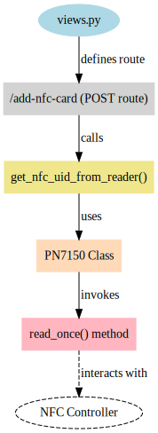

Based on the provided code snippets from `website/views.py` and `website/nfc_util_NXP.py`, along with the `PN7150` class from the `pn7150` library, we can detail how NFC technology is integrated into your project for user identification. Here's an overview of the key aspects:

### Overview of NFC Integration

1. **NFC Technology in the Project**: 
   - NFC (Near Field Communication) technology is used for identifying users via NFC ID cards. 
   - This enables a contactless, quick, and secure way to identify users before they interact with the inventory system.

2. **NFC Reading Mechanism**:
   - The `PN7150` class from the `pn7150` library is central to the NFC reading mechanism.
   - This class interfaces with the NFC hardware (presumably a PN7150 NFC controller) to read NFC tags.

3. **Retrieving NFC ID**:
   - The `get_nfc_uid_from_reader()` function in `nfc_util_NXP.py` is a crucial component. 
   - It calls `pn7150.read_once()`, which triggers a single read operation to retrieve the NFC ID from a user's NFC card.

4. **PN7150 Class Details**:
   - The `PN7150` class handles the interaction with the NFC hardware and provides several functionalities:
     - `start_reading()`: Begins continuous NFC tag reading in a separate thread, calling a callback function each time a tag is read.
     - `stop_reading()`: Stops the continuous reading process.
     - `read_once()`: Performs a single synchronous read of an NFC tag and returns its content.
     - `write()`: Writes data to an NFC tag and supports multiple write retries.

5. **User Interface Integration**:
   - In the Flask web application (`website/views.py`), the NFC reading function is integrated into the route `/add-nfc-card`.
   - When a POST request is made to this route, `get_nfc_uid_from_reader()` is invoked to read the NFC ID from the user's card.
   - The retrieved NFC ID is then associated with the current user's account in the system.

6. **User Feedback and Error Handling**:
   - The system provides feedback to the user on the success or failure of NFC card reading via flash messages.
   - This enhances the user experience by making the interaction intuitive and informative.

7. **Security and Privacy Considerations**:
   - The NFC ID is used as a means of identification, making it essential to consider security and privacy implications.
   - It's important to ensure that NFC data is securely handled and stored, and user privacy is respected.

### Importance in the Inventory Management System

The use of NFC technology simplifies the process of user identification, making it more efficient and user-friendly. This is particularly beneficial in a setting like inventory management for 3D printer filament, where quick and easy access to the system is desirable. NFC enhances the overall usability and security of the system, providing a seamless experience for users. 

### Suggestion for the "Theory" Part of Your Paper

In the "Theory" section of your paper, you can elaborate on how NFC technology works, its advantages in user identification, and how it's been implemented in your project. Discuss the technical details of the `PN7150` class and `get_nfc_uid_from_reader()` function, emphasizing their roles in the system. Additionally, you may want to cover the broader implications of using such technology in inventory management systems.

