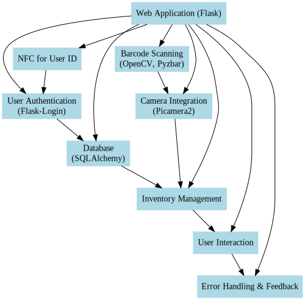

### 1. Introduction to the Project
- Briefly introduce the project's objective: developing a user interface for managing 3D printer filament inventory.
- Mention the use of NFC ID cards for user identification.

### 2. Overview of Technologies Used
- **Flask Web Framework**: Explain how Flask is used to create web routes and handle HTTP requests.
- **Flask-Login**: Describe its role in managing user sessions and authentication.
- **SQLAlchemy**: Introduce SQLAlchemy for database interactions.
- **NFC Technology**: Discuss the use of NFC for user identification, including the `get_nfc_uid_from_reader` function.
- **OpenCV and Pyzbar**: Explain their usage in barcode scanning and image processing.
- **Picamera2**: Describe the use of Picamera2 for Raspberry Pi camera integration.

### 3. System Architecture
- **Web Application Structure**: Describe the structure of the Flask application, focusing on the `Blueprint` module and its role in organizing the application.
- **Database Schema**: Provide an overview of the database schema, particularly for `Note` and `FilamentInventory` models.
- **User Authentication Flow**: Detail the process of user login, NFC card association, and session management.

### 4. Key Functionalities
- **Inventory Management**: Explain how the system logs filament usage, including the routes `/inventory`, `/update_weight`, and database interactions.
- **User Interaction**: Discuss user-facing functionalities like adding notes, managing NFC cards, and viewing filament inventory.
- **Barcode Scanning and Camera Integration**: Elaborate on how barcode scanning is implemented using OpenCV and Picamera2, focusing on the routes `/start_camera`, `/stop_camera`, and `/video_feed`.

### 5. Error Handling and User Feedback
- Discuss the implementation of error handling and user feedback mechanisms, such as the use of `flash` messages and JSON responses for error reporting.

### 6. Conclusion
- Summarize the key aspects of the system and its potential impact on inventory management efficiency.

### 7. Future Work
- Discuss potential enhancements or future directions for the project.

